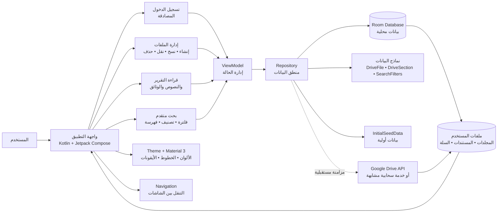

# مخطط واجهة المستخدم والبيانات



## شرح سريع

- المستخدم يتفاعل مع واجهات Compose عبر شاشات التطبيق.
- كل شاشة ترسل الأحداث إلى `ViewModel`.
- `ViewModel` يطلب البيانات من `Repository`.
- `Repository` يقرأ أو يكتب إلى `Room Database` محليًا.
- البيانات تُعرض في الواجهة فورًا بفضل حالة التطبيق التفاعلية.
- يمكن لاحقًا ربط المستودع بخدمة سحابية مثل Google Drive.

## هيكل التطبيق

```text
app/src/main/java/com/example/nizam/
├── MainActivity.kt
├── data/
│   ├── local/
│   │   ├── AppDatabase.kt
│   │   ├── DriveFileDao.kt
│   │   ├── DriveFileEntity.kt
│   │   └── InitialSeedData.kt
│   ├── model/
│   │   ├── DriveFile.kt
│   │   ├── DriveSection.kt
│   │   ├── SearchFilters.kt
│   │   └── NizamConstitutionalReport.kt
│   └── repository/
│       └── DriveRepository.kt
├── ui/
│   ├── components/
│   ├── screens/
│   └── theme/
├── viewmodel/
│   ├── DriveViewModel.kt
│   └── DriveViewModelFactory.kt
└── ...
```

## النطاق العملي لهذا المخطط

هذا المخطط مخصص لـ:
- عرض البنية الداخلية للتطبيق
- توضيح فصل الواجهة عن البيانات
- شرح كيف تتدفق المعلومات داخل التطبيق
- تقديم فكرة واضحة للعروض بدون تعقيد السحابة
