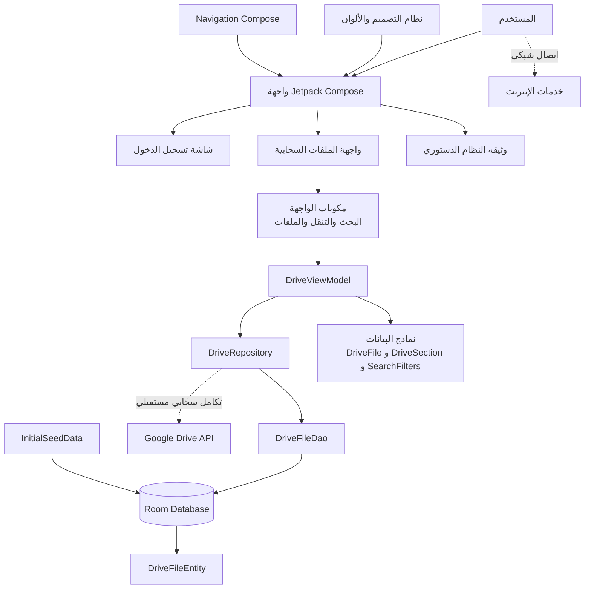

# مخطط معماري لتطبيق النظام

يوضح هذا المستند البنية العامة لتطبيق **النظام** المبني بلغة Kotlin وواجهة Jetpack Compose، مع طبقة بيانات محلية باستخدام Room.



## مكونات التطبيق

- **واجهة المستخدم:** شاشات Compose باللغة العربية لدعم تسجيل الدخول، إدارة الملفات، وقراءة الوثيقة الدستورية.
- **طبقة العرض:** `DriveViewModel` تدير حالة الشاشة، البحث، التصفية، والتنقل بين المجلدات.
- **طبقة المستودع:** `DriveRepository` تفصل منطق البيانات عن الواجهة، وتتيح إضافة التكامل السحابي لاحقًا.
- **قاعدة البيانات المحلية:** Room مع `DriveFileDao` و`DriveFileEntity` لحفظ الملفات والبيانات محليًا.
- **النماذج:** نماذج Kotlin تمثل الملفات، الأقسام، المرشحات، والتقرير الدستوري.
- **التصميم:** Material 3 وملفات الثيم والألوان والخطوط الموجودة في `ui/theme`.
- **التنقل:** Navigation Compose للتنقل بين شاشات التطبيق.

## تدفق البيانات

1. يتفاعل المستخدم مع إحدى شاشات Compose.
2. ترسل الشاشة الإجراء إلى `DriveViewModel`.
3. يطلب الـ ViewModel البيانات أو ينفذ العملية من خلال `DriveRepository`.
4. يستخدم المستودع `DriveFileDao` للوصول إلى قاعدة Room المحلية.
5. تعود النتائج إلى الواجهة عبر حالة Compose المراقبة.
6. يمكن ربط المستودع لاحقًا بخدمة Google Drive لمزامنة الملفات السحابية.

## بنية الحزم

```text
app/src/main/java/com/example/nizam/
├── MainActivity.kt
├── data/
│   ├── local/       # قاعدة Room و DAO والبيانات الأولية
│   ├── model/       # نماذج المجال
│   └── repository/  # مصدر البيانات
├── ui/
│   ├── components/  # عناصر Compose القابلة لإعادة الاستخدام
│   ├── screens/     # شاشات التطبيق
│   └── theme/       # الألوان والخطوط والثيم
└── viewmodel/       # إدارة حالة الواجهة
```
