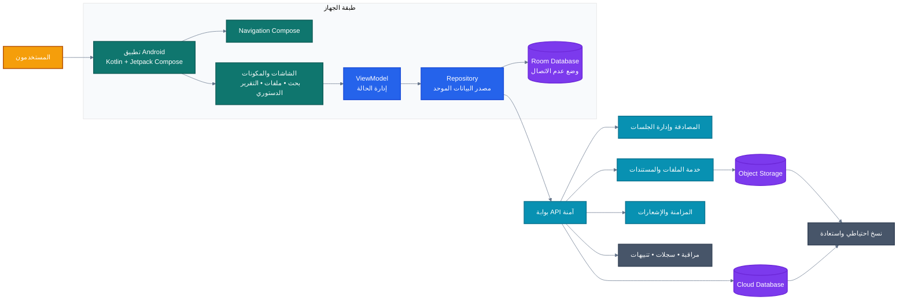
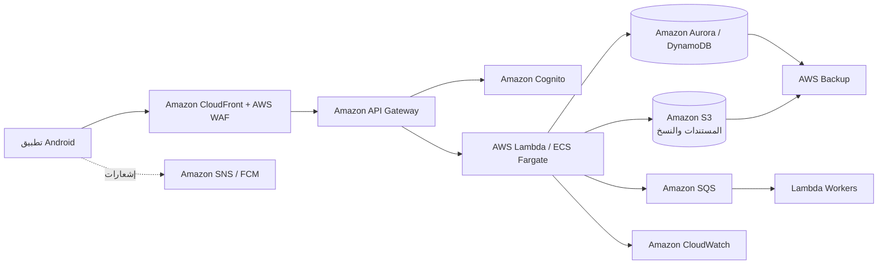
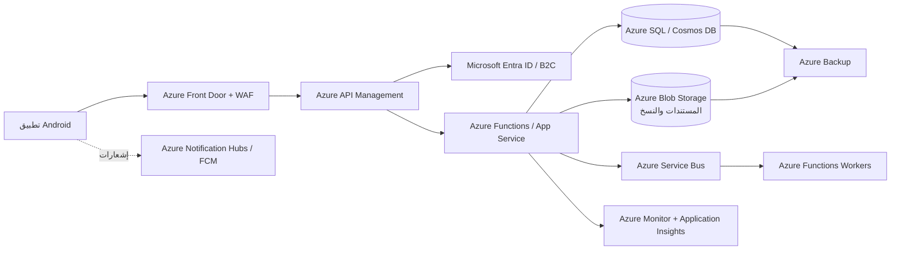
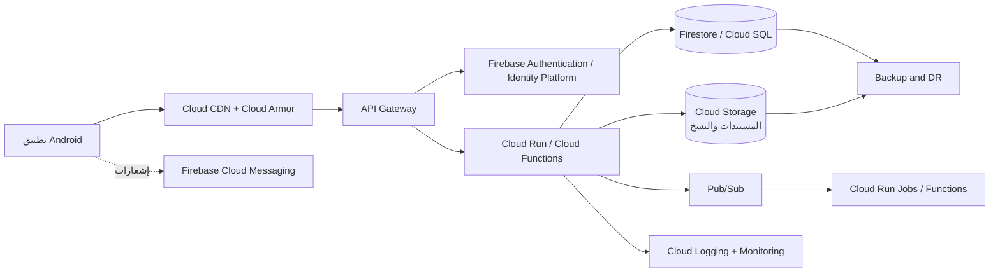

# المخطط المعماري التنفيذي لتطبيق النظام

> مخطط مناسب للعروض التقديمية يوضح تجربة المستخدم، طبقات التطبيق، وخيارات الاستضافة السحابية. أسماء الخدمات السحابية أدناه **تصميم مقترح** وليست تكاملات منفذة حاليًا.

## 1. المخطط التنفيذي الفاخر

## 2. مخطط AWS المقترح

## 3. مخطط Microsoft Azure المقترح

## 4. مخطط Google Cloud المقترح

## 5. مقارنة سريعة للخيارات

| المجال | AWS | Azure | Google Cloud |
|---|---|---|---|
| الهوية | Cognito | Entra ID / B2C | Firebase Auth / Identity Platform |
| واجهة API | API Gateway | API Management | API Gateway |
| الحوسبة | Lambda أو ECS | Functions أو App Service | Cloud Run أو Functions |
| قاعدة البيانات | Aurora أو DynamoDB | Azure SQL أو Cosmos DB | Cloud SQL أو Firestore |
| تخزين الملفات | S3 | Blob Storage | Cloud Storage |
| الرسائل | SQS / SNS | Service Bus / Notification Hubs | Pub/Sub / FCM |
| المراقبة | CloudWatch | Azure Monitor | Cloud Monitoring |

## 6. التوصية

- **لأسرع إطلاق لتطبيق Android:** Google Cloud مع Firebase Authentication وFirestore وCloud Storage وFCM.
- **لبيئة مؤسسية وهوية Microsoft:** Azure مع Entra ID وApp Service وAzure SQL.
- **لبنية واسعة وقابلة للتوسع:** AWS مع Cognito وAPI Gateway وLambda وS3 وAurora/DynamoDB.
- يُفضّل إبقاء `DriveRepository` كطبقة عزل، بحيث يمكن تبديل مزود السحابة دون إعادة بناء واجهة التطبيق.

## تدفق البيانات السحابي

1. يسجل المستخدم الدخول من تطبيق Android.
2. تتحقق خدمة الهوية من الجلسة وتصدر رمز وصول.
3. يرسل التطبيق الطلب إلى بوابة API عبر HTTPS.
4. تتحقق الخدمة من الصلاحيات وتقرأ أو تكتب البيانات.
5. تُخزّن الملفات الكبيرة في Object Storage، بينما تُخزّن البيانات الوصفية في قاعدة البيانات.
6. تُرسل الأعمال غير المتزامنة إلى Queue أو Pub/Sub لمعالجتها بواسطة Workers.
7. تُحفظ السجلات والتنبيهات والنسخ الاحتياطية عبر خدمات التشغيل السحابي.
