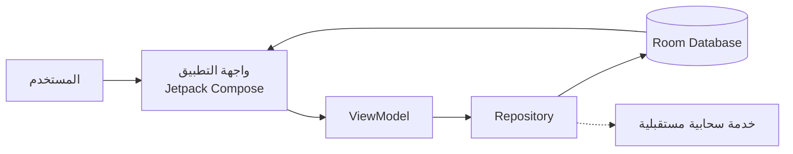

# مخطط مختصر لتطبيق النظام

مخطط مناسب للعرض في **PowerPoint** أو داخل ملف **README**:

## الفكرة في سطر واحد

يتفاعل المستخدم مع واجهة التطبيق، ثم تمر الطلبات عبر `ViewModel` و`Repository` للوصول إلى قاعدة بيانات Room، مع إمكانية إضافة مزامنة سحابية لاحقًا.

## المكونات الأساسية

| المكون | الدور |
|---|---|
| المستخدم | تنفيذ العمليات واستعراض المحتوى |
| Jetpack Compose | عرض واجهة التطبيق |
| ViewModel | إدارة حالة الشاشة |
| Repository | تنظيم مصدر البيانات |
| Room Database | التخزين المحلي |
| الخدمة السحابية | المزامنة المستقبلية |
